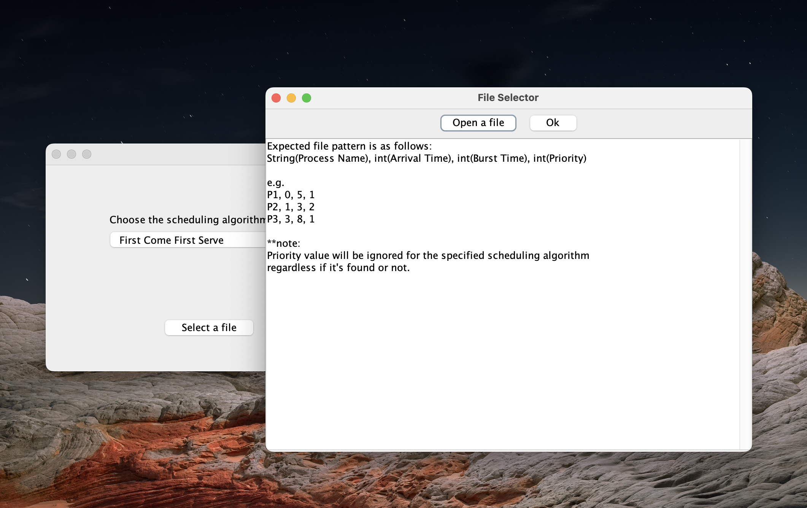
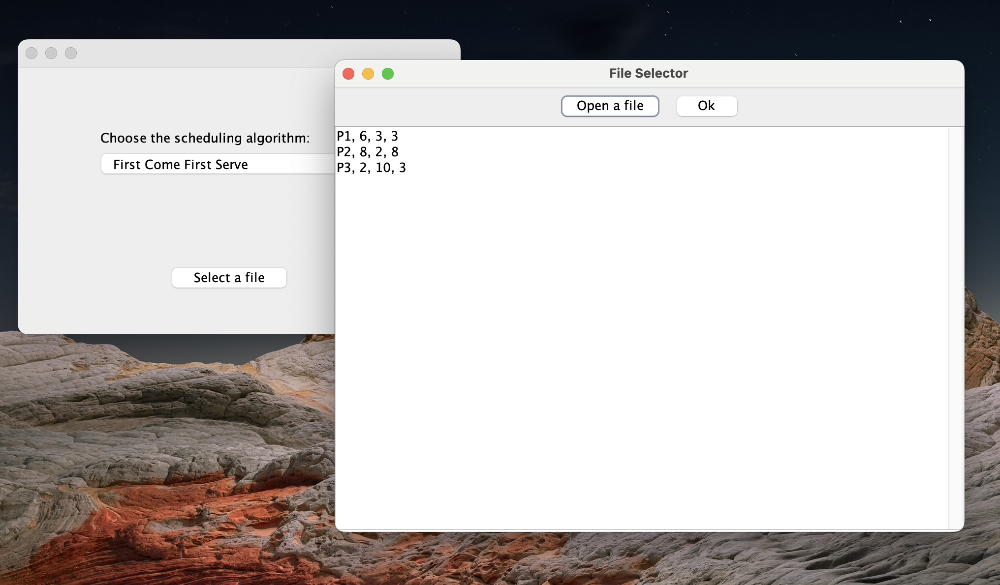
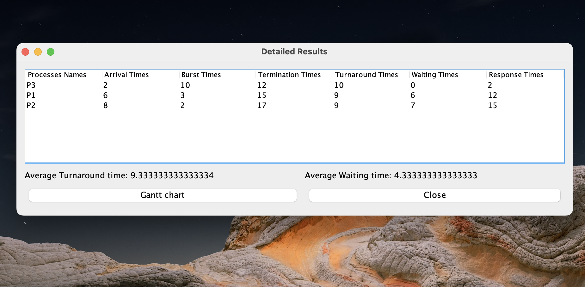
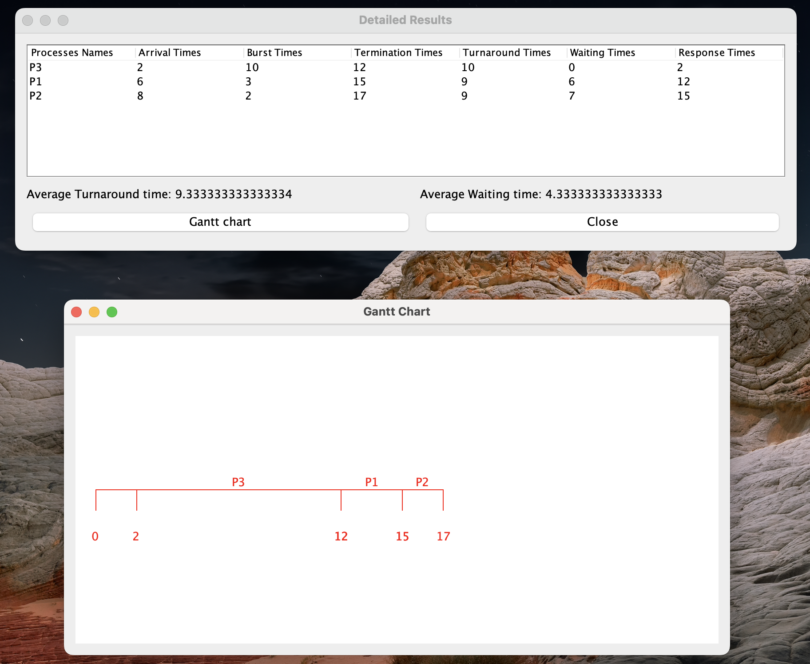

# Scheduling Processing Solver

This project is a scheduling processing solver that takes process details from a text file and performs various calculations to generate an optimal schedule. It also includes a GUI built with Swing that displays the Gantt chart of the generated schedule.

# Features

    Calculates the start time, end time, and turnaround time for each process
    Generates an optimal schedule based on various scheduling algorithms:
       - First Come First Served
       - Shortest Job First (preemptive)
       - Shortest Job First (non-preemptive)
       - Round Robin
       - Priority (preemptive)
       - Priority (non-preemptive)
    Displays the Gantt chart of the generated schedule using a GUI built with Swing

  |  
 
  |  
 
  |  
 

# Getting Started

To get started with this project, you can either download the source code or clone the repository using the following command:

git clone https://github.com/AhmadRFC/process_scheduling_solver.git

Once you have the source code, you can open it in your preferred IDE (such as Eclipse or IntelliJ) and run the Main class to launch the application.

# Usage

To use this program, you need to provide a text file containing the details of the processes you want to schedule. While on selecting the file UI you will be given an example of how the text file should be formatted.

# Contribution

This project was a collaborative effort between myself and my friends.
